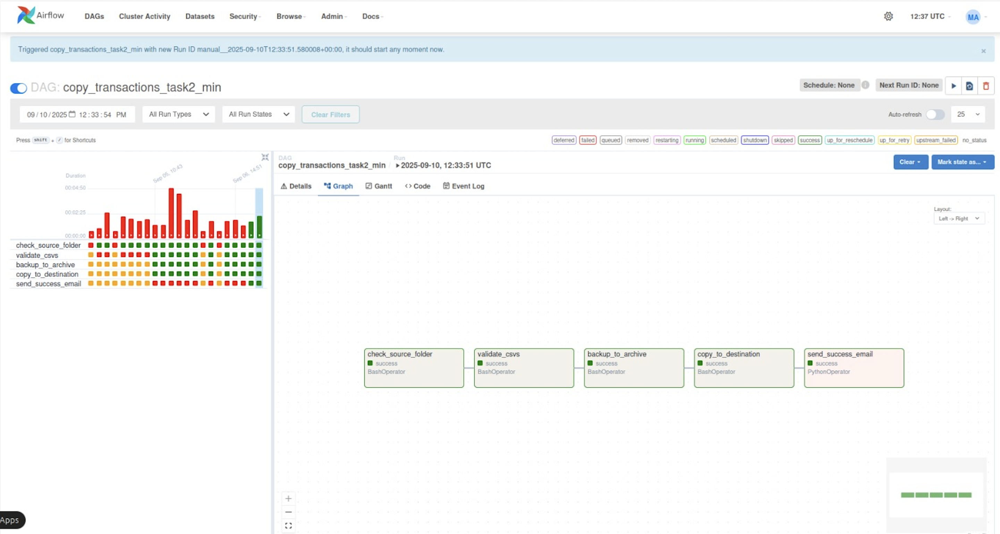

# airflow-hdfs-pipeline

This project implements an **Apache Airflow DAG** that validates CSV files stored in HDFS, archives them into a backup folder, copies them to a destination directory, and finally sends a success notification email.  
The validation step is powered by **PySpark**, ensuring schema consistency before files are moved.

---

##  Features
- **CSV Validation**: Uses PySpark to verify schema and columns in incoming CSVs.  
- **Archiving**: Automatically moves validated CSVs to an archive folder with a timestamped partition.  
- **Data Copying**: Copies archived CSVs to a destination HDFS path for downstream processing.  
- **Email Notifications**: Sends an email upon successful completion of the pipeline.  

---

##  Project Structure
```bash
airflow-orchestration/
├── dags/
│   └── copy_transactions_task2_min.py
├── jobs/
│   └── validate_csvs.py
├── assets/
│   └── airflow_dag_ui.png
├── requirements.txt
└── .gitignore


```

##  DAG Screenshot

This is the Airflow DAG UI for the pipeline.  
It shows the sequence of tasks:  
1. Check if the source folder exists in HDFS.  
2. Validate the CSV files schema using PySpark.  
3. Backup the files to an archive folder.  
4. Copy the files to a destination folder.  
5. Send a success email notification.  

- 
